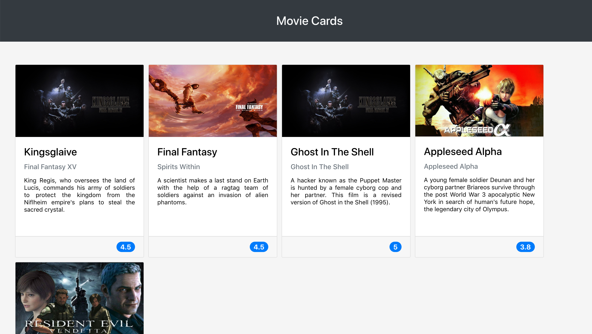

# Projeto Movie Cards Library
## 📋 Descrição do projeto
Um site com template para filmes, feito em React utilizando class components e propTypes.

## 📷 Screenshot

## 💻 Tecnologias utilizadas
- JavaScript
- React
- Class Components
- Styled Components
- ESLint
- Node
- NPM
- Git

## 🎓 Aprendizados
- Saber a melhor forma para instalar um gerenciador de pacotes
- Inicializar um projeto em **React**
- Utilizar JSX no **React**
- Utilizar o **ReactDOM.render** para renderizar elementos numa página web
- Utilizar o `import` para usar código externo junto ao seu
- Criar componentes **React** corretamente
- Fazer uso de `props` corretamente
- Fazer composição de componentes corretamente
- Criar múltiplos componentes dinamicamente
- Utilizar **PropTypes** para checar o tipo de uma prop no uso de um componente
- Utilizar **PropTypes** para garantir a presença de props obrigatórias no uso de um componente
- Utilizar **PropTypes** para checar que uma prop é um objeto de formato específico
- Utilizar **PropTypes** para garantir que uma prop é um array com elementos de um determinado tipo

## 📈 Status do projeto
✅ Concluído

## 🚀 Links
- Site no ar: [Link](https://movie-cards-library-theta.vercel.app/)

## :busts_in_silhouette: Contribuintes
<table>

<tr  style="width:120px">

<td  align="center">

<a  target=”_blank”  href="https://github.com/Dogl4">

 

<b>Pedro Barreto</b>

</a>

</td>

</tr>

</table>
